# NetMaze Explorer

# (Implement and manage virtual networking)


Design a hybrid networking environment where on-premises networks connect securely to Azure resources using Azure's
networking capabilities, ensuring secure data transition and effective resource access controls.

**Project Source: [madebygps](https://github.com/madebygps/projects/blob/main/az-104/netmazeexplorer.md)**

Reference: [Tutorial: Create a site-to-site VPN connection in the Azure portal](https://learn.microsoft.com/en-us/azure/vpn-gateway/tutorial-site-to-site-portal)


### Cloud Network Environment


### On-Premises Network Environment


## Create resource groups for entire network infrastructure


*Azure Portal: **Resource Groups** > Create*


```
Name: netmazeexplorer-cloud-rg
Name: netmazeexplorer-onpremises-rg
```


## 1. Azure Virtual Network Setup

Provision an Azure Virtual Network (VNet) in your chosen region.

Create multiple subnets within this VNet to segregate resources effectively (e.g., WebApp Subnet, Database Subnet, Admin Subnet).


*Azure Portal: **Virtual networks** > Create*


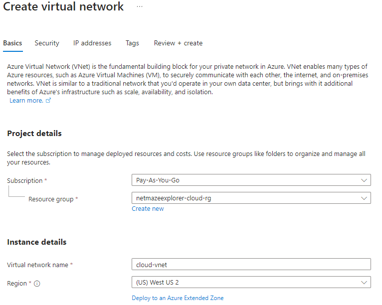

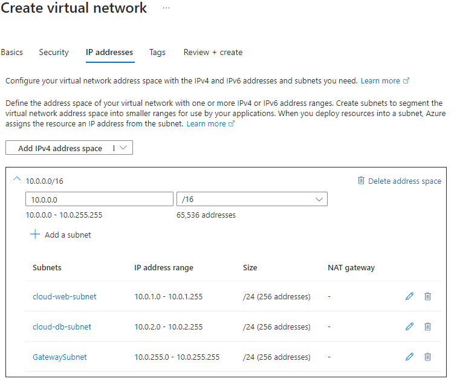


## 2. On-Premises Network Simulation

For the sake of this project, use another VNet to simulate your on-premises environment. This can be in another Azure region or the same region based on preference.


*Azure Portal: **Virtual networks** > Create*


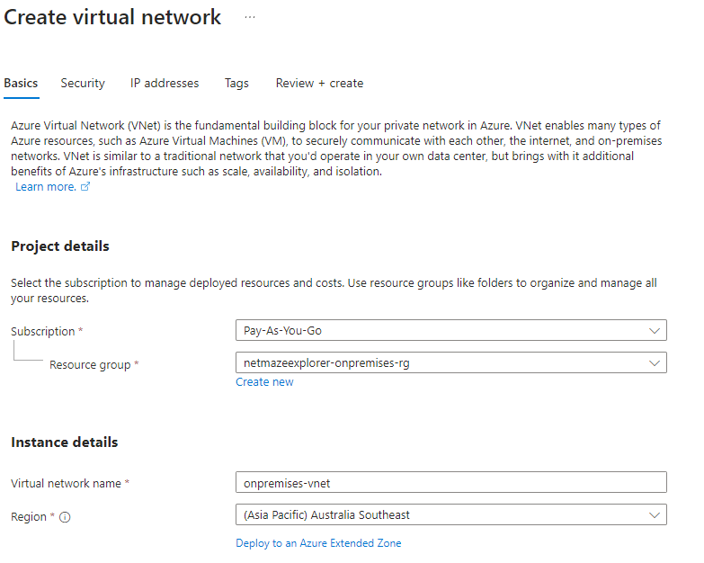

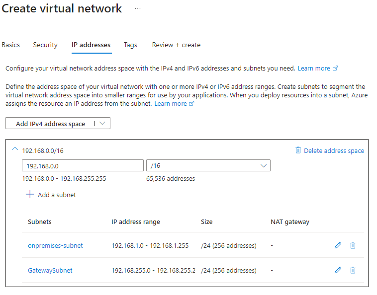


## 3. Secure Connectivity

Implement Azure VPN Gateway to create a site-to-site VPN connection between your simulated on-premises environment (VNet) and your main Azure VNet.

Verify the connection and ensure resources from one VNet can communicate with another, effectively simulating a hybrid environment.


*Azure Portal: **Public IP addresses** > Create*


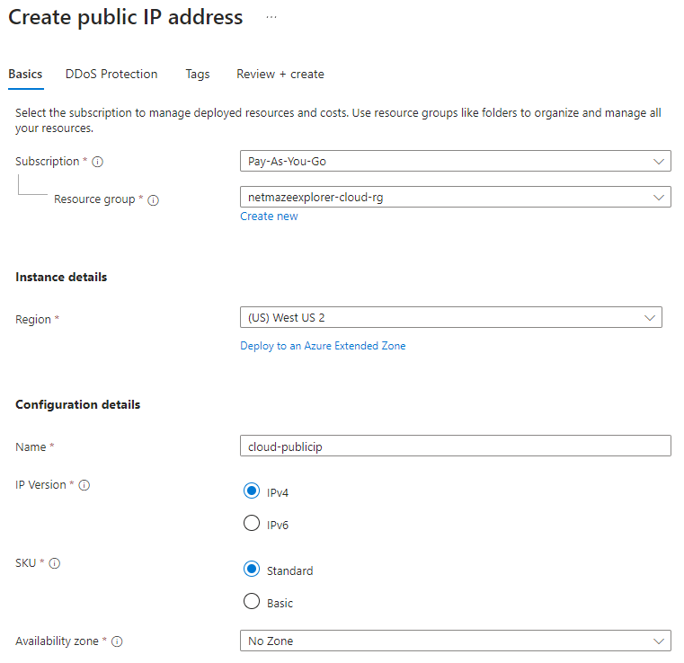


*Azure Portal: **Virtual network gateways** > Create*


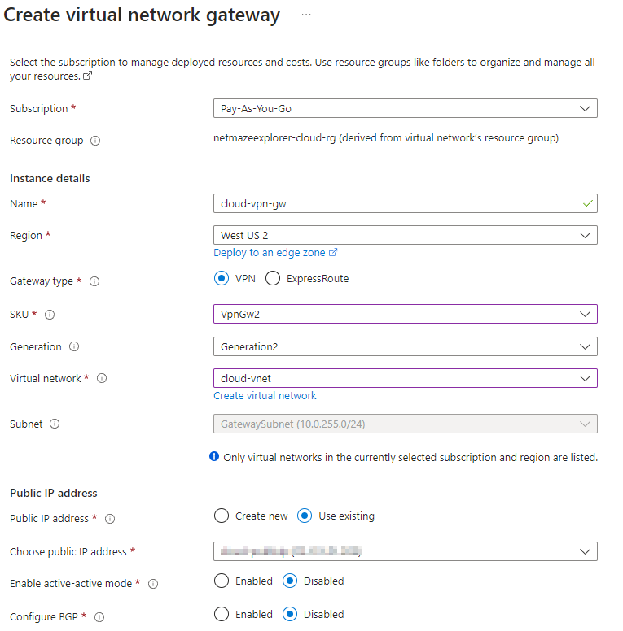


*Azure Portal: **Local network gateways** > Create*


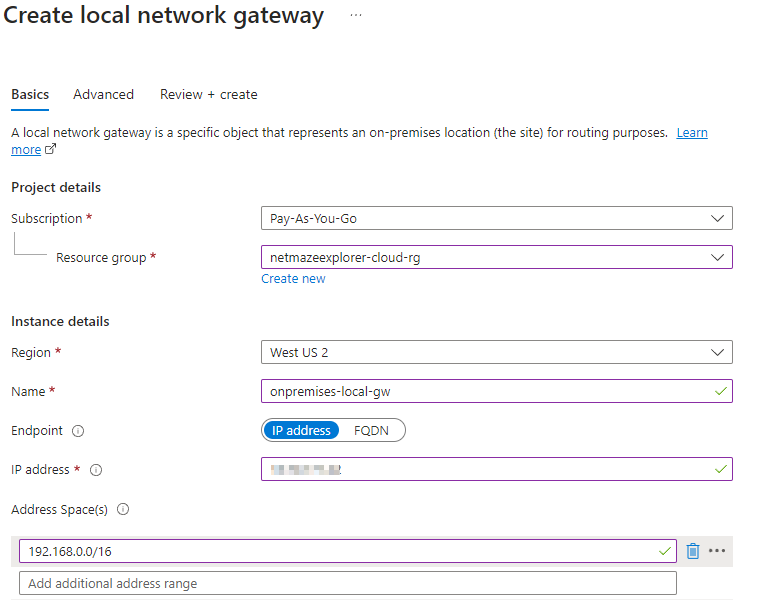


*Azure Portal: Virtual Network > Connected devices > Virtual network gateway > **Connections** > Add*


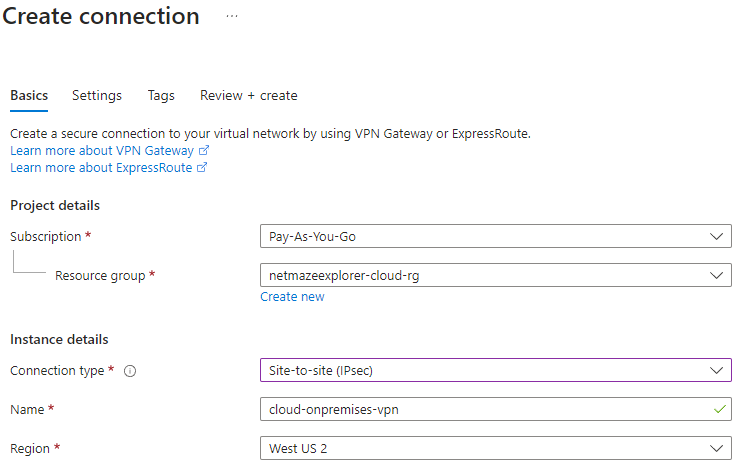

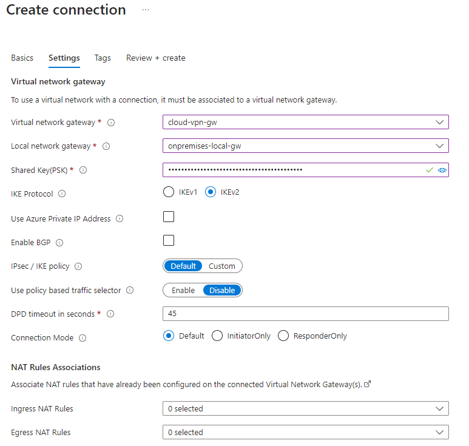


*Azure Portal: **Public IP addresses** > Create*


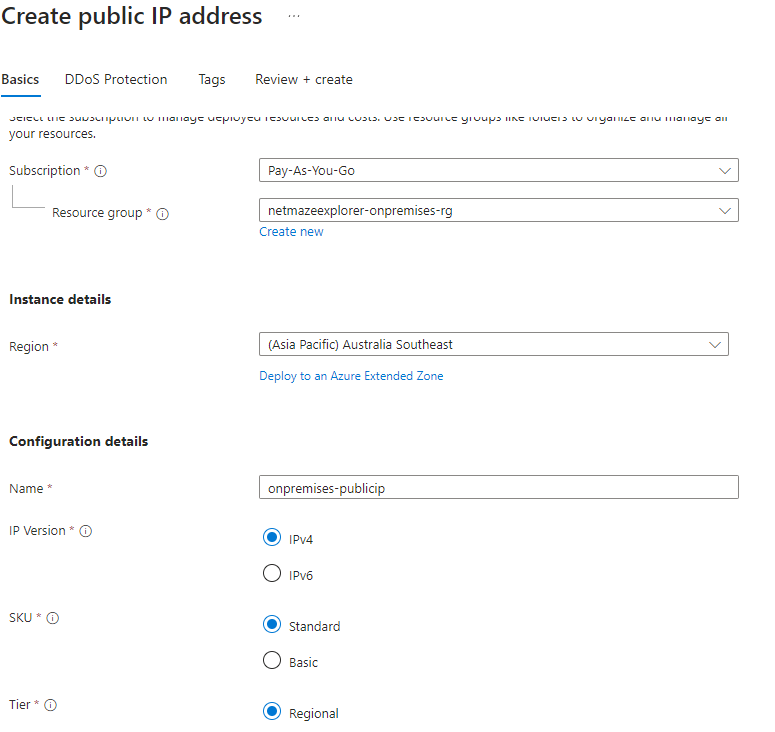


*Azure Portal: **Virtual network gateways** > Create*


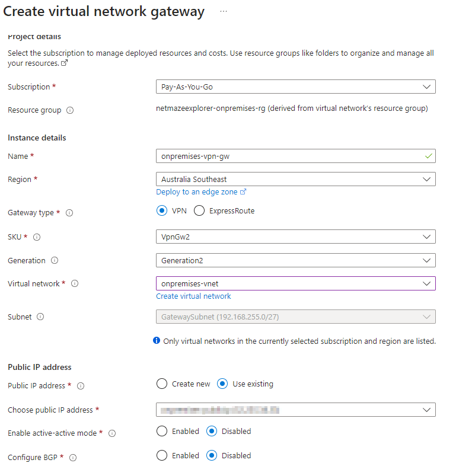


*Azure Portal: **Local network gateways** > Create*


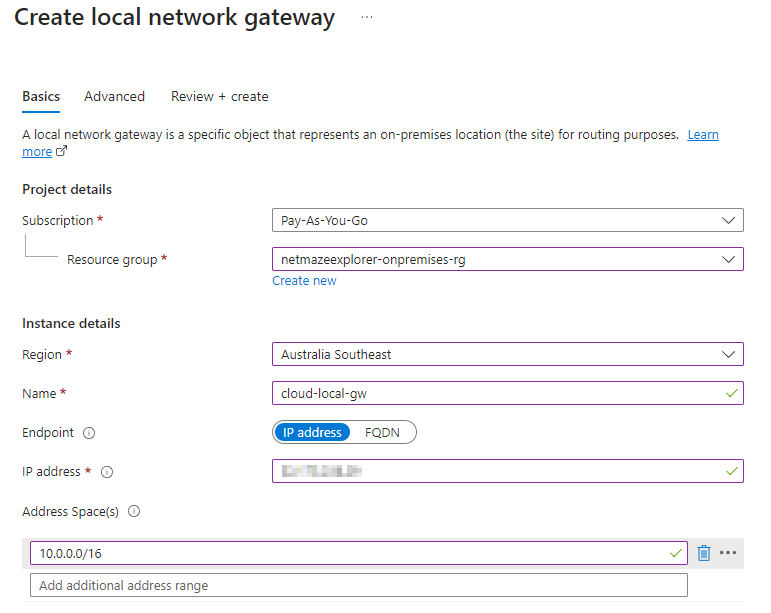


*Azure Portal: Virtual Network > Connected devices > Virtual network gateway > **Connections** > Add*


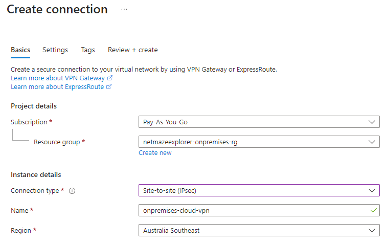

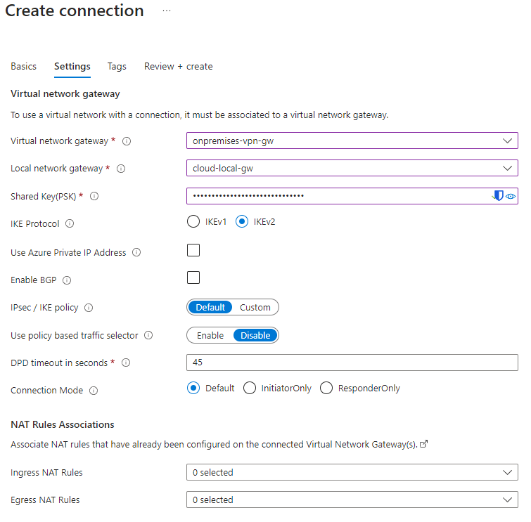


**Check VPN Connectivity**

*Azure Portal: Virtual network gateways > VPN gateway > **Connections** > Status*


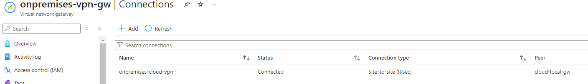


## 4. Resource Deployment

Deploy test resources (like VMs) in each subnet of your main Azure VNet. For instance, deploy a web server VM in the WebApp Subnet, a database in the Database Subnet, etc.


*Azure Portal: **Virtual machines** > Create*


```
Resource Group: netmazeexplorer-onpremises-rg
Name: onpremises-vm
Region: Australia Southeast
Image: Ubuntu Server 24.04 LTS
Size: Standard_B1ls
Disk: Standard HDD
Subnet: onpremises-subnet
Inbound port: SSH (22)
Private IP: 192.168.1.4 (Dynamic)
```


*Azure Portal: **Virtual machines** > Create*


```
Resource Group: netmazeexplorer-cloud-rg
Name: cloud-web-vm
Region: US West 2
Image: Ubuntu Server 24.04 LTS
Size: Standard_B1ls
Disk: Standard HDD
Subnet: cloud-web-subnet
Inbound port: SSH (22)
Private IP: 10.0.1.4 (Dynamic)
```


*Azure Portal: **SQL databases** > Create*


```
Resource Group: netmazeexplorer-cloud-rg
Name: cloud-db-sql
Database Server Name: cloud-db-sql.database.windows.net
Compute + storage: Standard-series (Gen5), 1 vCore, 32 GB storage, zone redundant disabled
Region: US West 2
Connectivity method: Private endpoint
Private Endpoint Name: cloud-db-endpoint
Subnet: cloud-db-subnet
Inbound port: SSH (1433)
Private IP: 10.0.2.4 (Dynamic)
```


## 5. Network Access Control

Use Network Security Groups (NSGs) to define inbound and outbound access rules for each subnet, ensuring that only valid traffic is allowed.

For instance, only allow HTTP/HTTPS traffic to the WebApp Subnet.


*Azure Portal: **Network security groups** > Create*


```
Resource Group: netmazeexplorer-cloud-rg
Name: cloud-web-nsg
Region: US West 2
```


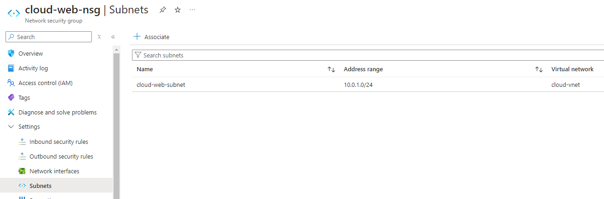


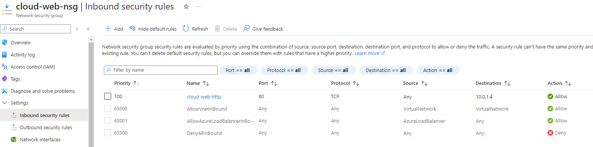


```
Resource Group: netmazeexplorer-cloud-rg
Name: cloud-db-nsg
Region: US West 2
```


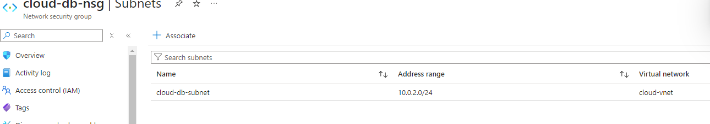


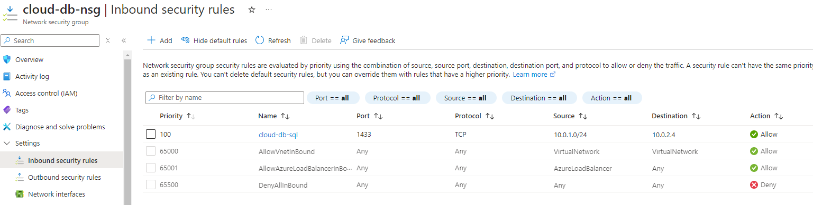


```
Resource Group: netmazeexplorer-onpremises-rg
Name: onpremises-nsg
Region: US West 2
```


## 6. Secure Administrative Access

Implement Azure Bastion for secure and seamless RDP and SSH access to your virtual machines, ensuring you don't expose your VMs to the public internet.

Set on-premise and cloud VM's to not use an NSG. NSG's are applied to the VNet subnets.


*Azure Portal: Virtual machines > VM > **Connect via Bastion***


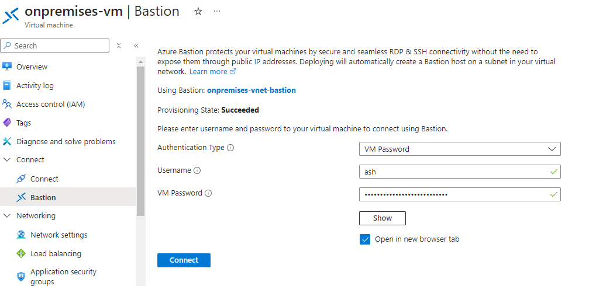


## 7. Private Access to Azure PaaS Services:

Use Azure Private Link to access Azure PaaS services (like Azure SQL Database) over a private endpoint within your VNet, ensuring data doesn't traverse over the public internet.


*Azure Portal: **Private Link Centre** > Private endpoints*


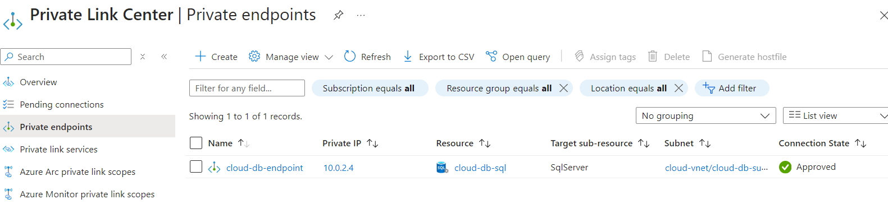


## 8. DNS and Load Balancing

Configure Azure DNS to have custom domain names for your resources.
Implement Azure Load Balancer to distribute traffic across your VMs in the WebApp Subnet.


*Azure Portal: **Private DNS zones** > Create*


```
Resource Group: netmazeexplorer-onpremises-rg
Name: netmazeexplorer.local
Link Name: cloud-vnet-dns
Virtual Network: cloud-vnet
Auto registration: Enabled
```


*Azure Portal: **Load balancing** > Create*


```
Resource Group: netmazeexplorer-onpremises-rg
Name: netmazeexplorer.local
Name: cloud-web-lb
Region: West US 2
SKU: Basic
Type: Public
Tier: Regional
Frontend IP configuration:
- Name: cloud-web-lb-frontend
- Public IP address: cloud-web-lb-publicip
Backend pool:
- Name: cloud-web-lb-backendpool
- Virtual network: cloud-vnet
- Backend pool configuration: NIC
- IP configurations: cloud-web-vm, cloud-web-vm2
Inbound rule:
- Name: cloud-web-lb-http
- Port: 80
```


## 9. Performance and Security Testing

Simulate various network scenarios to test performance, such as data transition between on-premises and Azure.

Attempt to access resources from outside the permitted paths to validate the security configurations in place.


Test connectivity to web server.


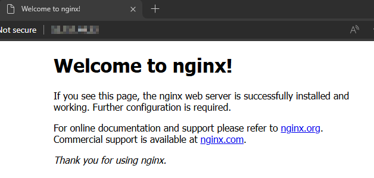


Test connectivity between on-premises and cloud web VM.

```bash
ash@onpremises-vm:~$ ping 10.0.1.4
PING 10.0.1.4 (10.0.1.4) 56(84) bytes of data.
64 bytes from 10.0.1.4: icmp_seq=1 ttl=64 time=174 ms
```


Test connectivity between cloud web and cloud db VM.

```bash
ash@cloud-web-vm:~$ nc -zv 10.0.2.4 1433
Connection to 10.0.2.4 1433 port [tcp/ms-sql-s] succeeded!
```
